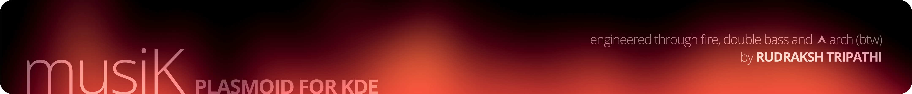

# MusiK Plasmoid
Engineered with a love for music, skinned in Zune nostalgia, and refined down to the last pixel, MusiK is a slick music player plasmoid, based on MPRIS2, Crafted for the detail-obsessed. Built for Plasma.


## Features
- **Fully Customizable Typography**
MusiK lets you fine-tune the font settings for both the mini and full player views. Choose your preferred font family, size, adjust letter spacing, and toggle capitalization to match your desktop’s personality — or your mood.

- **Zune-Inspired Waveform Visualizer**
A sleek, animated waveform inspired by the iconic Zune interface.

- **Adaptive Accents from Album Art**
MusiK samples the dominant color from your album art and uses it to accent key UI elements — like the audio visualizer, seek bar, text, and buttons — creating a player that visually matches every track.

- **Customizable spacing**
Adjust the spacing between the UI elements to suit your aesthetic preferences. Whether you prefer a compact look or a more spacious layout, MusiK has you covered.

- **Smooth Animations & Scroll Behavior**
The subtle animations and scroll behavior ensure a fluid and responsive experience.

- **Built for Plasma**
Designed to blend effortlessly with your Plasma theme, it feels right at home on your desktop. Specifically tailored for translucent themes and panels.

- **MPRIS2 based**
MusiK is built on the MPRIS2 protocol, ensuring compatibility with a wide range of media players. It works seamlessly with popular players like Spotify, VLC, and more.

## Screenshots


- A longer demo


## Installation
1. Clone the repository:
```bash
git clone https://github.com/Rudraksh88/musik-plasmoid /tmp/musik-plasmoid
```

2. Install the widget:
```
kpackagetool6 -i /tmp/musik-plasmoid/com.rudraksh.musik/ --type Plasma/Applet
```

3. Upgrading the widget:
```bash
kpackagetool6 -u /tmp/musik-plasmoid/com.rudraksh.musik/ --type Plasma/Applet
```

4. Removing the widget:
```bash
kpackagetool6 -r com.rudraksh.musik --type Plasma/Applet
```

## Roadmap
- [ ] Add dynamic waveform visualizer that reacts to the music.
- [ ] Add settings for changing sizes of icons and other UI elements.
- [ ] Text Animations on song change.
- [ ] Opaque backgrounds (irrespective of the Plasma theme)
- [ ] Clean up the settings UI.

## Contributing
Contributions are welcome! If you have suggestions, bug reports, or feature requests, please open an issue or submit a pull request.

## Support
This plasmoid was powered up using 100% organically-sourced, sustainably-grown coffee and a lot of late nights. If it brought you joy, consider providing a treat — coffee, snacks  and beer accepted. Donations may unlock bonus content (or at least a grin).

[](https://www.buymeacoffee.com/rudraksh.tripathi)

<!-- Patreon: [Rudraksh Tripathi](https://patreon.com/RudrakshTripathi?utm_medium=unknown&utm_source=join_link&utm_campaign=creatorshare_creator&utm_content=copyLink) -->

<!-- PayPal -->
[](https://www.paypal.me/rudrakshtripathi)

**Only for India** UPI: `rudraksh-tripathi@ibl`

## Credits and Acknowledgements
This project began as a fork of [plasmusic-toolbar by ccatterina](https://github.com/ccatterina/plasmusic-toolbar). Since then, it has evolved substantially, and I would like to acknowledge the original author for their work which served as the foundation for this project.

## License
**MusiK Plasmoid**
**Copyright (C) 2025 Rudraksh Tripathi**

This program is free software: you can redistribute it and/or modify it under the terms of the GNU General Public License as published by the Free Software Foundation, version 3.

See the [**LICENSE**](LICENSE) file for the complete license text.